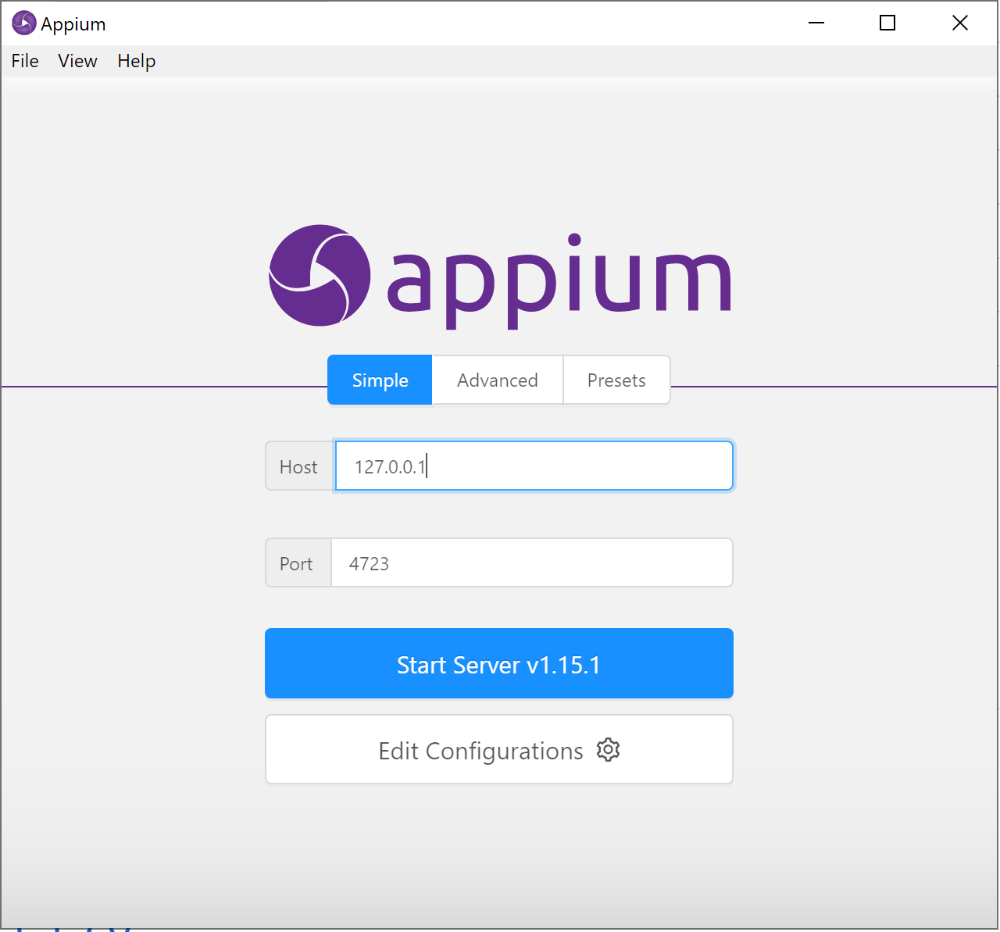
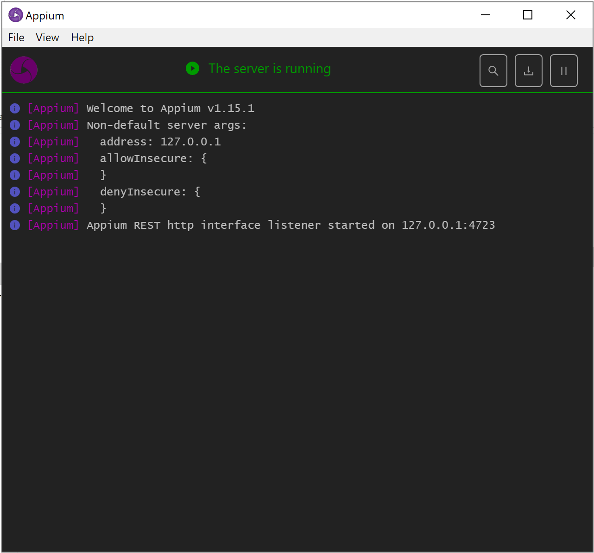
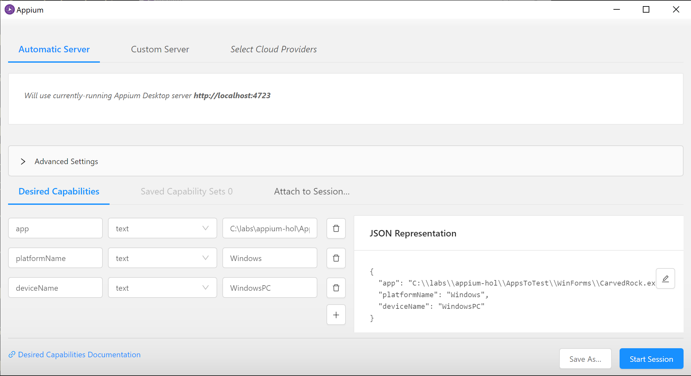

# Getting Started with Appium

This is the description on how to set up your machine so you can start testing applications

## Generic Appium Desktop Installation
Goto the Appium website and goto the section getting started.

<a href="http://appium.io/docs/en/about-appium/getting-started/?lang=en">http://appium.io/docs/en/about-appium/getting-started/?lang=en</a>

Follow the steps on installing the `Desktop App`

Select the download package for the windows platform:
<a href="https://github.com/appium/appium-desktop/releases">Appium Desktop App Releases</a>

At the moment of this writing the latest version for windows is Appium-windows-1.15.1.exe

# Testing Windows Applications
When you want to test windows applications, you need to install the Windows Driver for appium. This is called the WinAppDriver. You can find the latest version of the drivere here: <a href="https://github.com/Microsoft/WinAppDriver/releases">https://github.com/Microsoft/WinAppDriver/releases</a>

Here you find the installer you need to run called: `WindowsApplicationDriver.msi`

After installing the driver you can now start Appium Desktop.
When you start the application it will start with the following screen:

Specify you want to run the appium server on your localhost. So you specify the Host Ip adress to be: 127.0.0.1

Now you start the server.

You will see the following screen, that indicates Appium is ready to accept requests from any client that wants to run a UI Test.

## Validate your installation
You can run the inspector that is part of the Appium Desktop client to start e.g. the windows forms application and then inspect it in the tool. This validates you have the Windows Driver installed and that it can start your application.

click on the Inspection Glass Icon and then fill out the following properties. (This is case sensitive!)

> app = C:\labs\appium-hol\AppsToTest\WinForms\CarvedRock.exe  DeviceName = WindowsPC 
platformName = Windows

The moment you start you might experience some issues if you are missing some pre-requisites

* Windows is not in Developer mode
In this case you need to go to the windows settings, or type in the windows task bar search "developer mode" and then select the developer moed option

* Dotnet framework 4.8 is not installed
Click on the error dialog and install the .NET framework 4.8 runtime package on your machine, so you can run the windows forms application.

If all works as expected, then you should see the windows app started and you should be able to see the app in the inspector, where you can see how to search for specific elements in the UI.

# Android applications
TODO: Android

# iOS Applications
TODO: iOS