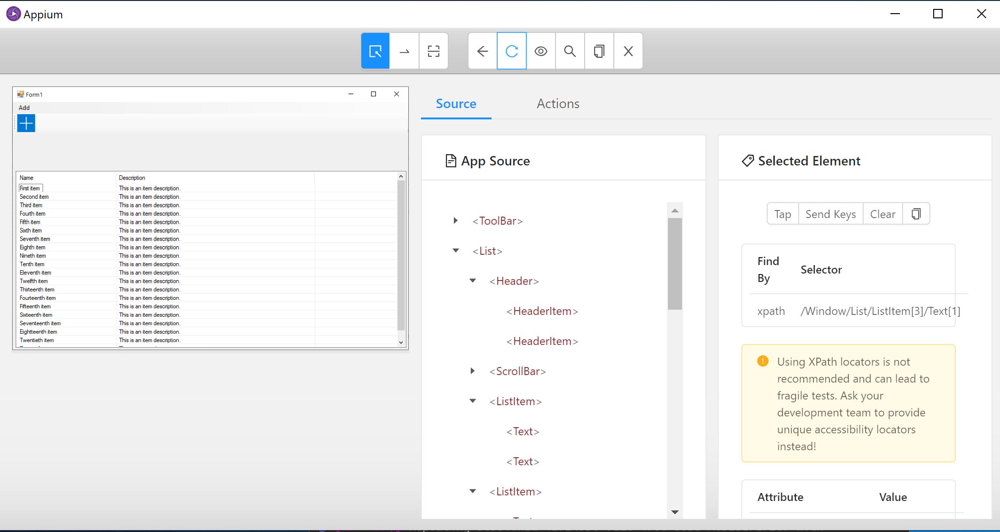

# Getting Started with Appium

This is the description on how to set up your machine so you can start testing applications

## Generic Appium Desktop Installation
Goto the Appium website and goto the section getting started.

http://appium.io/docs/en/about-appium/getting-started/?lang=en

Follow the steps on installing the `Desktop App`

Select the download package for the Windows platform:
[Appium Desktop App Releases](https://github.com/appium/appium-desktop/releases).

At the moment of this writing, the latest version for windows is `Appium-windows-1.15.1.exe`

# Testing Windows Applications

When you want to test Windows applications, you need to install the _Windows Driver for Appium_. This is called the `WinAppDriver`. You can find the latest version of the driver here: https://github.com/Microsoft/WinAppDriver/releases

Here you find the installer you need to run called: `WindowsApplicationDriver.msi`

After installing the driver, you can now start _Appium Desktop_.

When you start the application it will start with the following screen:


Specify that you want to run the Appium server on your `localhost`. So you specify the `Host Ip` address to be: `127.0.0.1`

Now you start the server.

You will see the following screen, which indicates that Appium is ready to accept requests from any client that wants to run a UI Test.


## Validate your installation

You can run the inspector that is part of the _Appium Desktop_ client to start, e.g. the Windows Forms application, and then inspect it in the tool. This validates that you have the _Windows Driver_ installed and that it can start your application.

Click on the _Inspection Glass Icon_ and then fill out the following properties. **This is case sensitive!**

```
app = C:\labs\appium-hol\AppsToTest\WinForms\CarvedRock.exe
DeviceName = WindowsPC
platformName = Windows
```


The moment you start you might experience some issues if you are missing some pre-requisites

* Windows is not in _Developer Mode_. In this case, you need to go to the _Windows Settings_, or type `developer mode` in the Windows taskbar search, and then select the _Developer Mode_ option.

* _.NET Framework 4.8_ is not installed. Click on the error dialog and install the _.NET Framework 4.8  Runtime_ package on your machine so that you can run the Windows Forms application.

If all works as expected, then you should see the Windows app started, and you should be able to see the app in the inspector, where you can see how to search for specific elements in the UI.



You are now ready to start with [Lab 01](lab-01.md), where you will write your first UI tests for WinForms.

# Android applications
TODO: Android

# iOS applications
TODO: iOS
