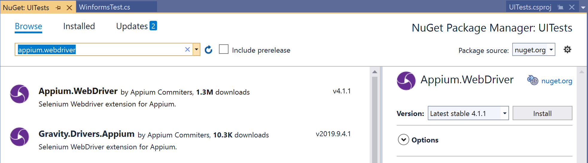

# Hands-on Lab Testing Windows GUI Applications with Appium

In this Hands-on Lab (HOL), you will create a new test project and use it to test a set of applications via their UI. You can find the applications to test in the folder `AppsToTest`. In this folder, you will find the most common types of applications. These are:

* _Windows Forms Applications_
* _Windows WPF Applications_

## Creating the test application

Start visual Studio and create a new project of the type `Test Project`, that can target any platform using .NET Core. The following screenshot shows the type of project to select:


Give the project the name `UITests`.

Rename the initially created test class called `UnitTest1.cs` to a more meaningful name. We will start with testing our Windows Forms application, so name it `WinformsTest.cs`

Add the NuGet Package `Appium.Webdriver` to your test project. This provides the client mapping of the Appium driver protocol into a set of C# classes.

The package should look as follows:



After the package is added, let's write a first test, where we start the application and close the application.

Rename the test method called `TestMethod1` and name it: `Test_Application_Start_and_Stop()`.

Add the following code, to start the application:

```c#
var capabilities = new AppiumOptions();

capabilities.AddAdditionalCapability(MobileCapabilityType.App, @"C:\temp\appium-hol\AppsToTest\WinForms\CarvedRock.exe");
capabilities.AddAdditionalCapability(MobileCapabilityType.PlatformName, "Windows");
capabilities.AddAdditionalCapability(MobileCapabilityType.DeviceName, "WindowsPC");

// start the application
var driver = new WindowsDriver<WindowsElement>(new Uri("http://127.0.0.1:4723/wd/hub"), capabilities);

// close the application
driver.CloseApp();
driver.Dispose();
```

> **Note**: You probably need to make a change to the location of the app, since you might have cloned the Hands-on lab repository at a different location on your machine.

Run the test and see if it succeeds. Failure reasons can be:
* Prerequisites are not met, please check the [Getting started](GettingStarted.md)
* You did not start the _Appium Desktop_ application before you ran the test
* The location of your executable is at a different location. Copy &amp; Paste the location of the `.exe` in your Explorer and see if it will start. If not, find the correct location.

## Adding Screenshots to the test results

You can add screenshots to the test, by taking the screenshot and adding it to the test context that is available in the _MS Test_ framework. This can be very convenient if you want the automated tests to be used also as evidence certain tests have passed.

Add the following code to the top of the test class:

```C#
static TestContext _ctx;

[ClassInitialize]
public static void Initialize(TestContext ctx)
{
    _ctx = ctx;
}
```

Add code to the test method for capturing the screenshot, saving it to a file and attaching it to the test results. The code goes between starting and stopping the application.

```C#
var screenshotFilename = Guid.NewGuid().ToString() + ".png";
driver.GetScreenshot()
      .SaveAsFile(screenshotFilename);
_ctx.AddResultFile(screenshotFilename);
```

## Finding an element and clicking it

Now we want to find an element on the screen. For this, we need to discover how we can find the element. This can be done by using various finder methods available on the driver object.

The best way to find an element is by using their automation properties. But for this, we need the developer of the application to have set this field so we can find it easily.

We can detect how to find elements, by using the _Appium Desktop_ application, starting the app, as described in the [Getting Started guide](GettingStarted.md).

Find the `AutomationID` of the _Add_ button, so we can click it.

Now add a new test that will find the button, click it and then verifies the dialog is created. Then close the application.

The code you write should look as follows:

```C#
[TestMethod]
public void Test_Application_Add_Item_Dialog_Is_Shown()
{
    var capabilities = new AppiumOptions();
    capabilities.AddAdditionalCapability(MobileCapabilityType.App, @"C:\temp\appium-hol\AppsToTest\WinForms\CarvedRock.exe");
    capabilities.AddAdditionalCapability(MobileCapabilityType.PlatformName, "Windows");
    capabilities.AddAdditionalCapability(MobileCapabilityType.DeviceName, "WindowsPC");

    //start the application
    var driver = new WindowsDriver<WindowsElement>(new Uri("http://127.0.0.1:4723/wd/hub"), capabilities);

    // click add
    var addButton = driver.FindElementByName("AddNewItem");
    addButton.Click();

    // verify we are showing the dialog
    var AddDialogWindow = driver.FindElementByAccessibilityId("NewItemForm");

    var textLabel1 = AddDialogWindow.FindElementByAccessibilityId("label1");
    Assert.IsTrue(textLabel1 != null);

    //close the dialog
    var closeButton = AddDialogWindow.FindElementByName("Close");
    closeButton.Click();

    //stop the application
    driver.CloseApp();
    driver.Dispose();
}
```

Now write a final test that not only shows the dialog, but also fills in the fields, then presses the _Ok_ button, and verifies that the item is added to the listview.

The solution to this should look something as follows:

```C#
[TestMethod]
public void Test_Application_Add_Item_Dialog_AddsNewItem()
{
    var capabilities = new AppiumOptions();
    capabilities.AddAdditionalCapability(MobileCapabilityType.App, @"C:\temp\appium-hol\AppsToTest\WinForms\CarvedRock.exe");
    capabilities.AddAdditionalCapability(MobileCapabilityType.PlatformName, "Windows");
    capabilities.AddAdditionalCapability(MobileCapabilityType.DeviceName, "WindowsPC");

    // start the application
    var driver = new WindowsDriver<WindowsElement>(new Uri("http://127.0.0.1:4723/wd/hub"), capabilities);

    // click add
    var addButton = driver.FindElementByName("AddNewItem");
    addButton.Click();

    // verify we are showing the dialog
    var AddDialogWindow = driver.FindElementByAccessibilityId("NewItemForm");

    var textLabel1 = AddDialogWindow.FindElementByAccessibilityId("label1");
    Assert.IsTrue(textLabel1 != null);

    var inputFieldItem = AddDialogWindow.FindElementByName("ItemText");
    inputFieldItem.Clear();
    inputFieldItem.SendKeys("New Item Text");

    var InputFieldItemDetail = AddDialogWindow.FindElementByName("ItemDetail");
    InputFieldItemDetail.Clear();
    InputFieldItemDetail.SendKeys("New item details text");

    // close the dialog
    var AddButton = AddDialogWindow.FindElementByAccessibilityId("button1");
    AddButton.Click();

    // scroll the list to the end
    var scrollDownButton = driver.FindElementByAccessibilityId("DownButton");
    scrollDownButton.Click();
    scrollDownButton.Click();

    // verify we can find the item in the list
    var listview = driver.FindElementByAccessibilityId("listView1");
    var newElement = listview.FindElementByName("New Item Text");

    Assert.IsTrue(newElement != null);

    // close the application
    driver.CloseApp();
    driver.Dispose();
}
```

## Whats next? More maintainable test code!

The previous code shows how you can test the UI, but the way we coded these examples is hard to maintain. Please continue with the next Lab exercise where we experiment with the `PageObject` pattern and see how we can write maintainable test automation code.
[Lab 02](lab-02.md).