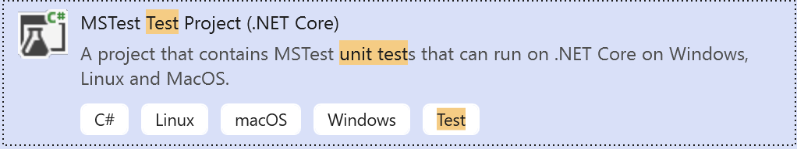

# Hands-on Lab Testing Windows GUI Applications with Appium

In this Hands-on Lab (HOL) you will create a new test project and use this to test a set of applications via their UI.
You can find the applications to test in the folder `AppsToTest`.
In this folder, you will find the most common types of applications. These are:

* Windows Forms Applications
* Windows WPF Applications

## Creating the test application
Start visual studio and create a new project of the type Test Project, that can target any platform using .NET Core. The following screenshot shows the type of project to select:

Give the project the name UITests.

Rename the initially created test Class called class1.cs to a more meaningful name. We will start with testing our Windows Forms application, so name it WinformsTest.cs

